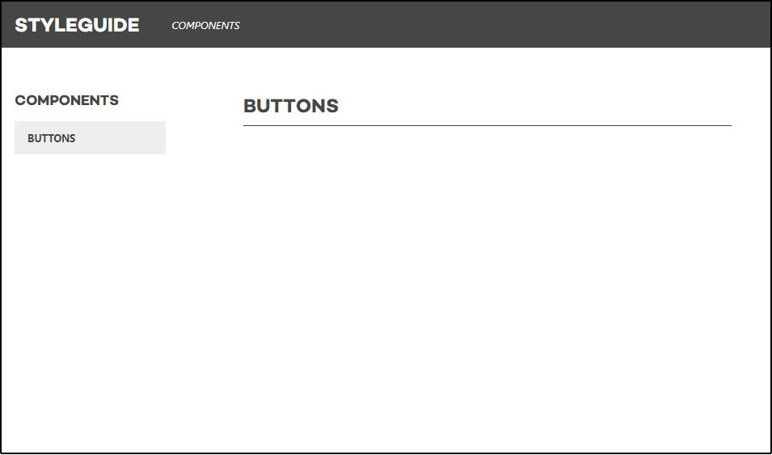

# Htmldev Bundle

Create living Styleguides with Symfony and Twig! ✨

---

- [Goals](#goals)
- [Install](#install)
- [How to use](#how-to-use)
   - [Setup](#setup)
   - [Adding stuff to the styleguide](#adding-stuff-to-the-styleguide)
      - [Components](#components)
      - [Rendering components in the styleguide](#rendering-components-in-the-styleguide)
      - [Pages](#pages)
      - [Adding navigation](#adding-navigation)
      - [Colors](#colors)
      - [Icons](#icons)
      - [Typography](#typography)
   - [Using the styleguide in the project](#using-the-styleguide-in-the-project)
      - [Rendering components](#rendering-components)
      - [Rendering SVG files](#rendering-svg-files)
   - [Customising](#customising)
- [Development](#development)
   - [CSS](#css)
---

## Goals

- Provide a single visual source for the design of a project.
- Serve components and assets from the styleguide to prevent code duplication.
- Deliver a good developer experience (DX) ✨ that makes creating a good-looking styleguide very easy.

## Install

1. Require via composer.   

   ```
   composer require zicht/htmldev-bundle
   ```

## How to use

### Setup

1. Load the bundle into your AppKernel.   

   ```php
   new Zicht\Bundle\HtmldevBundle\ZichtHtmldevBundle()
   ```

2. Configure routing.

   Add the following Yaml to your app's route configuration.   

   ```yaml
   htmldev:
      resource: "@ZichtHtmldevBundle/Resources/config/routing.yml"
   ```

   ⚠️ if you combine this bundle with the [zicht/page-bundle](https://github.com/page-bundle), make sure this configuration is placed *above* any routing containing `/{locale}`.

3. Add a app/config/bundles/ bundle configuration file to configure a Twig namespace and add project specific assets to
the Styleguide (optionally you can configure the svg cache, see down below):

    ```yaml
    twig:
        paths:
            "%kernel.root_dir%/../htmldev": htmldev

    zicht_htmldev:
        styleguide:
            assets:
                -  type: stylesheet
                   path: 'assets/main.css'
                -  type: script
                   path: 'assets/main.min.js'
    ```

    For the Styleguide, there are two asset types: stylesheet and script. For both you can either configure a `path`
    which will be passed through the Twig `asset()` function, or you can configure a URL (to an external stylesheet
    or script for instance) or you can configure a `body` to add inline CSS or scripting.

4. Create a directory `data/styleguide/` in the `htmldev/` directory. Add a file `navigation.yml` containing at least
the following:

   ```yaml
   -
       title: Components
       uri: /htmldev/components/buttons
   ```

5. Go to the styleguide's URL at `/htmldev` (e.g. http://localhost/htmldev) and you should see a basic setup of the styleguide:

   

6. By default SVG's will be cached on every other environment then development. This is due to performance reasons. It
makes use of file caching for the rendered SVG files. In order to disable this on development you may want this to be
array. To achieve this you could set the config param just like this:

    ```yaml
    zicht_htmldev:
        svg_cache: array
    ```

    other supported options are file and apcu or a service id where the class implements the [PSR-16](https://github.com/php-fig/fig-standards/blob/master/accepted/PSR-16-simple-cache.md).

### Adding stuff to the styleguide

#### Components

Components are simple Twig templates which represent a small peace of the design of a project, for example a button or a card.
The HtmldevBundle looks for these components in the `htmldev/components/` folder. Inside this directory, you're free to
structure them how you want.

The component is rendered inside a Twig control structure `` block from the [zicht/framework-extra-bundle](https://github.com/zicht/framework-extra-bundle)
which means there's no need for strict `null` or empty checks on variables inside a component: a simple `` will suffice.

**Recommended**: for easy conditional CSS classes, the HtmldevBundle automaticall loads the [zicht/twig-classes](https://github.com/zicht/twig-classes)
helper function:

```twig
 
   
<article class="{{ cx.article }}">
    ...
</article>
```

#### Rendering components in the Styleguide

The HtmldevBundle loads the example/dummy data for the components from Yaml files from the `htmldev/data/` directory.

For example, it loads a `htmldev/data/buttons.yml`:

```yaml
-
    styleguide_title: Blue button
    styleguide_type: buttons/text
    text: Button
    color: blue
-
    styleguide_title: White button outline
    styleguide_type: buttons/text
    styleguide_dark: true
    outline: true
    text: Button
    color: white
```

This way, you can add components to the styleguide without typing Twig code. The keys that start with `styleguide_`
are only used to influence rendering of the component in the styleguide. The other keys are properties of the component itself.

The available options for rendering in the styleguide are:

- `styleguide_type`   
  The name of the component to show. For example, `buttons/text` corresponds to the file `htmldev/components/buttons/text.html.twig`.
- `styleguide_title`   
  The title that will be rendered with the component.
- `styleguide_description`   
  An extra description of the component that will be rendered below the title.
- `styleguide_dark` (`true`|`false`)   
  A boolean indicating whether the styleguide should render the component on a dark background, for example for white buttons.
- `styleguide_component_width`   
  Override the default width of the component in the styleguide. Use a pixel/percentage/viewport unit to change the width of the component
  next to the code example, e.g. `styleguide_component_width: 500px`. Or to render the code example below the component, use `styleguide_component_width: full`.

#### Pages

The bundle renders default pages for all the components that are added to the `navigation.yml` and their own data
Yaml files. The templates for the Styleguide reside within the HtmldevBundle own `Resources/views/styleguide/`
directory and can be overridden within the project's `htmldev/pages/` directory. Both directory's structure looks
like below. The HtmldevBundle has a base `component.html.twig` template for all components. You can override this
template in your project's `htmldev/pages/` directory to do global changes. In your project's
`htmldev/pages/` directory you can create a `components/` subdirectory and add custom templates for specific components
(the base name part of the template file should be the same as the base name of the Yaml file).
The design elements do have their own template within the HtmldevBundle, which are all based on the
`component.html.twig` template (either the one in your project's `htmldev/pages/` directory or the one of the Htmldev
bundle).

Relative directory structure:

```
 ./
  ├─ component.html.twig
  ├┈ (components/)
  │  ├┈ (buttons.html.twig)
  │  ├┈ (cards.html.twig)
  │  └┈ (headers.html.twig)
  └─ design-elements/
     ├─ colors.html.twig
     ├─ icons.html.twig
     └─ typography.html.twig
```

#### Adding navigation

The HtmldevBundle supports two levels of navigation in the styleguide. The items that make up the menu should be added
to `htmldev/data/styleguide/navigation.yml`.

Example of a navigation structure:

```yaml
-
    title: Components
    uri: /htmldev/components/buttons
    items:
        -
            title: Buttons
            uri: /htmldev/components/buttons
        -
            title: Cards
            uri: /htmldev/components/cards
-
   title: Design Elements
   uri: /htmldev/design-elements/colors
   items:
       -
           title: Colors
           uri: /htmldev/design-elements/colors
       -
           title: Icons
           uri: /htmldev/design-elements/icons
       -
           title: Typography
           uri: /htmldev/design-elements/typography
```

#### Colors

The HtmldevBundle Styleguide page Design Elements > Colors will read the color Sass map inside the file
`htmldev/sass/variables/_zss-overrides.scss` and renders these colors inside a grid.

The page is using a Twig function `color_palette()` and passes the filename `_zss-overrides.scss`. You can override
this page (see [Pages](#pages)) to change/add the files it is reading from.

The default color service assumes variables of the [ZSS](https://github.com/zicht/zss) framework, but feel free to
use a different service. See the [Customising](#customising) section.

#### Icons

The HtmldevBundle Styleguide page Design Elements > Icons will render the icons in the directory `htmldev/images/icons/`
(no subdirectories).

#### Typography

The HtmldevBundle Styleguide page Design Elements > Typography contains a static set of typographical elements such as
`<h1>`, `<h2>`, `<h3>` and `<h4>` headings, a few `<p>` paragraphs, a `<blockquote>` quote with a `<footer>` and a few
`<ul>` unordered lists. The paragraphs and lists contain some `<a>` links.

You can override this page (see [Pages](#pages)) to customize the HTML specially for your project.

### Using the styleguide in the project

#### Rendering components

The HtmldevBundle provides a `component` macro to render components from the styleguide anywhere in your application.

This wil load `htmldev/components/cards/cover.html.twig` with the given properties:
 
```twig


{{ ui.component('cards/cover', { 
    title: 'Hodor',
    url: '/some/page'
}) }}
```

#### Rendering SVG files

The HtmldevBundle provides an `svg` macro to inline render SVG's located in `htmldev`. This allows
easy coloring of the SVG with `currentColor` and CSS.

This will render the contents of `htmldev/images/icons/arrow--right.svg` in the HTML:

```twig


{{ ui.svg('arrow--right', { 
    width: 20,
    height: 20,
    directory: 'images/icons'
}) }}
``` 

The second argument is an options object. These keys are available:

- `width`    
  The width that should be set on the `<svg />` element. This will override an existing `width` attribute.  
  The macro assumes `px`, so `width: 20` will be rendered as `<svg width="20px" />`. 
  Allowed values: [MDN](https://developer.mozilla.org/en-US/docs/Web/SVG/Attribute/width#svg).
- `height`    
  The height that should be set on the `<svg />` element. This will override an existing `height` attribute.  
  The macro assumes `px`, so `height: 20` will be rendered as `<svg height="20px" />`. 
  Allowed values: [MDN](https://developer.mozilla.org/en-US/docs/Web/SVG/Attribute/height#svg).
- `viewbox_x` and `viewbox_y`    
  The `x` and `y` values of the `viewbox` property. This will override an existing `viewbox` attribute. These arguments
  must both be passed, otherwise they will not be applied. 
  `viewbox_x: 20, viewbox_y: 30` will be rendered as `<svg viewbox="0 0 20 30" />`.
- `css_classes`   
  An array of CSS classes that will be applied to the `<svg />` element.
  `css_classes: ['u-white', 'u-block']` will be rendered as `<svg class="u-white  u-black" />`.
- `attributes`   
  An array of extra attributes that will be applied to the `<svg />` element.
  This can be any attribute that's valid for the `<svg />` element.
  The default value for this parameter is `{ 'aria-hidden: 'true', 'role: 'img' }`.
- `title`   
  This will add a `<title />` element inside the `<svg />` for accessibility improvements.
  Reference: [MDN](https://developer.mozilla.org/en-US/docs/Web/SVG/Element/title)
- `directory`   
  The directory where the SVG file is located. This must be a directory inside the directory that's marked as 
  the root of the HtmldevBundle (default `htmldev`).
   
### Customising

There are several Symfony parameters available to override, to add a different implementation.

- `htmldev.directory` (default: `%kernel.root_dir%/../htmldev`)   
  Change the styleguide directory. 
- `htmldev.controller`   
  The controller that handles the requests for pages inside the styleguide.
- `htmldev.color_service`   
  The service that reads colors from a Sass variable in ZSS. To change the way this works, implement the `ColorServiceInterface` 
  class and change this parameter to your own class.
- `htmldev.svg_service`   
  The service that returns the contents of SVG files. To change the way this works, implement the `SvgServiceInterface` and
  change this parameter to your own class.

## Development

### CSS

The bundle contains a CSS file to provide default styling for the styleguide. 

- The source of this CSS file is `styleguide.scss`, located in the [Resourcs/sass](src/Zicht/Bundle/HtmldevBundle/Resources/sass) folder.
- The Sass files are compiled with webpack and node-sass.
- The Sass files are linted with [stylelint-config-zicht](https://github.com/zicht/stylelint-config-zicht).

Run `npm run build` to add your features or bug fixes to the compiled CSS file, and don't forget to commit the 
resulting files in `~/Resources/public/css`.

## Maintainer

* Peter Benner ([@wpbenner](https://github.com/wpbenner))
* Peter Knijff ([@pknijff](https://github.com/pknijff))
* Jurg Roessen ([@Hangloozz](https://github.com/Hangloozz))
